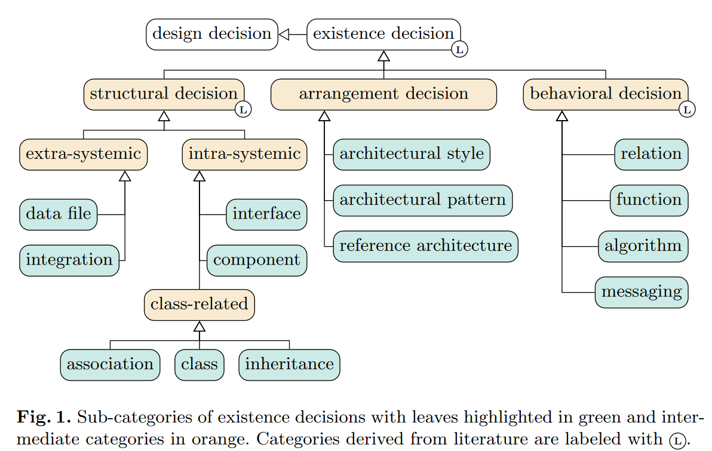
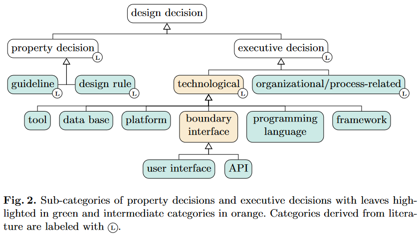

# A Taxonomy for Design Decisions in Software Architecture Documentation
This is the supplementary material repository of the paper "A Taxonomy for Design Decisions in Software Architecture Documentation".
In this paper, we propose a taxonomy for design decisions in software architecture
documentation with the purpose to support activities, such as specific test case creation, trace link recovery, or the identification of inconsistencies between different artifacts.
Additionally, we developed a new dataset comprising 17 software architecture documentations from publicly available open-source projects. We classified the contained design decisions based on the taxonomy.
Further, we explored if state-of-the-art machine learning-based classifier are able to automatically identify the design decisions and their subcategories in the dataset.

This repository contains the dataset and code used in the paper, as well as information on the annotation process:

* [dataset](./dataset/) contains the extracted software architecture documentations (`.txt` files) and the per-line labels (`.csv` files) 
* [annotation](./annotation/) contains information about our labeling:
	* [texts](./annotation/texts): the extracted software architecture documentations
	* [annotator1](./annotation/annotator1): the results of the labeling of the main annotator for all 17 documentations
	* [annotator2](./annotation/annotator2): the results of the first annotator involved in the labeling of the three projects used for manual validation
	* [annotator3](./annotation/annotator3): the results of the second annotator involved in the labeling of the three projects used for manual validation
	* [IAAgreement](./annotation/IAAgreement/): inter-annotator agreement (Krippendorf's α, KALPHA)
* [implementation](./implementation/) contains the python modules and notebooks used to produce the results of the automated classification
* [results](./results/) contains the results of the automated classification

| :exclamation:  Please Note:  |
|-----------------------------------------|
|Note that we are not able to provide the actual models that were used to produce the results of the paper. We used 5-fold cross validation experiments with three repeats that would result in a huge amount of model files. As the model files are quite large, this is not feasible. The results may still be reproduced with the supplied notebooks.|

## Dataset overview and attribution
| No. | Project       | Domain               | \#Lines | Link                                                        |
|----:|---------------|----------------------|--------:|-------------------------------------------------------------|
|   1 | ZenGarden     | Media                |     109 | https://github.com/mhroth/ZenGarden/                  |
|   2 | SpringXD      | Data Management      |      95 | https://github.com/spring-projects/spring-xd/         |
|   3 | BIBINT        | Science              |      22 | https://github.com/pebbie/BIBINT/                     |
|   4 | ROD           | Data Management      |     119 | https://github.com/apohllo/rod/                       |
|   5 | tagm8vault    | Media                |      16 | https://github.com/metafacets/tagm8-vault/            |
|   6 | MunkeyIssues  | Software Development |      23 | https://github.com/seandgrimes/MunkeyIssues/          |
|   7 | OnionRouting  | Networking           |      51 | https://github.com/mangei/onion-routing/              |
|   8 | Calipso       | Web Development      |      30 | https://github.com/cliftonc/calipso/                  |
|   9 | IOSched       | Event Management     |      81 | https://github.com/google/iosched/                    |
|  10 | MyTardis      | Data Management      |     100 | https://github.com/mytardis/mytardis/                 |
|  11 | SCons         | Software Development |      79 | https://scons.org/                                    |
|  12 | OpenRefine    | Data Management      |      21 | https://github.com/johnconnelly75/OpenRefine/         |
|  13 | Beets         | Media                |     125 | https://github.com/steinitzu/beets/                   |
|  14 | Teammates     | Teaching             |     252 | https://github.com/TEAMMATES/teammates/               |
|  15 | QMiner        | Data Analysis        |      92 | https://github.com/qminer/qminer/                     |
|  16 | Spacewalk     | Operating System     |      38 | https://github.com/spacewalkproject/spacewalk/        |
|  17 | CoronaWarnApp | Healthcare           |     369 | https://github.com/corona-warn-app/cwa-documentation/ |

## Taxonomy overview

The following tables shows examples for the leaf classes.

| Name                           | Example 
|:-------------------------------|---------
| Data file                      | The result is exported as CSV-file. 
| Integration                    | Data is observed using Kotlin Flows and the Data Binding Library binds UI components to the data sources.  
| Interface                      | his class defines a basic interface to receive a message, process it, and then immediately send it to any connected objects.
| Component                      | The Common component contains utility code. 
| Association                    | Objects might be linked with each-other via has_one and has_many relationships.
| Class                          | The initial request is forwarded to the `WebPageServlet` class.
| Inheritance                    | There are two general types of requests: user-invoked requests and automated requests.
| Architectural Style            | The system is layered in two tiers: a web tier and a storage tier.  
| Architectural Pattern          | We use Model-View-Viewmodel (MVVM) in the mobile application.
| Relation                       | The viewmodel components access their corresponding model components to retrieve data.
| Function                       | New identifiers are derived from a Temporary Exposure Key.
| Algorithm                      | For signing, the Elliptic Curve Digital Signature Algorithm (ECDSA) is used.
| Messaging                      | Identifiers are ID numbers sent out by the mobile phones.
| Guideline                      | Where possible, open source libraries are used. 
| Design Rule                    | If a user deletes and reinstalls the app, the stored registration token is lost. 
| Organizational/Process-related | All changes to the API must be approved by the architecture team.
| Tool                           | For instrumentation, valgrind is used.
| Data base                      | The server stores the UUID into the database.
| Platform                       | The system uses the Google App Engine (GAE) for deployment.
| Programming Language           | The web UI is a mixture of perl as well as Java technologies. 
| Framework                      | The Corona-Warn-App uses a new framework provided called Exposure Notification Framework.
| User Interface                 | Users can scan the QR code.
| API                            | The communication to the admin server is over HTTP.

